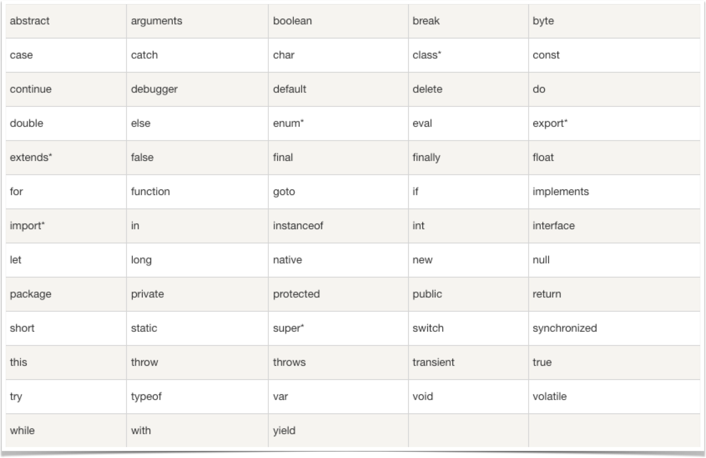

# 什么是变量和常量。

## 什么是变量？

> 维基百科中解释道：
>
> 在程序设计中，变量是指一个包含部分已知或未知数值或信息（即一个[值](https://zh.wikipedia.org/wiki/值_(電腦科學))）的内存地址，以及相对应的变量名称。

当然，如果你认为维基百科的解释晦涩难懂，那我们可以用另一句话来概括： **变量是一个存储数据值的容器**。

在javascript中，**声明变量** 一般有三种方式：`var`、`let`、`const` 

其中 `var`、`let` 是 **声明可变变量** 的两个关键字。

它们的区别是：

|     **var**      |    **let**     |
| :--------------: | :------------: |
|    全局作用域    |   块级作用域   |
| 存在变量提升问题 | 无变量提升问题 |
|    可重复声明    |  不可重复声明  |

但是它们也有共同点：**函数作用域范围内都不影响全局变量**。

## 什么是常量？

**常量** 是一个 **不可变化** 的 **量** 。

声明常量时需要注意以下两点：

- 声明时必须赋值，否则报错
- 声明后值不可被改变，否则报错

`const` 与 `let` 声明的变量的特点类似：

- 块级作用域
- 无变量提升问题
- 不可重复声明
- 函数作用域范围内都不影响全局变量

## 怎么使用代码声明一个变量？

以下是声明一个变量名为 `a` ，值为 `1` 的全局变量的代码语句：

```javascript
var a = 1;
```

代码声明变量一般有五部分组成：

1. `var` ：声明变量的关键字
2. `a` ：变量名
3. `=` ：赋值运算符
4. `1` ：值
5. `;` ：语句结束符

## 变量命名规则

1. 变量命名必须以 **字母、下划线 ”_” 或者美元符号 ”$”** 为开头。其他字符可以是 **字母、下划线 ”_”、美元符号 ”$”或数字** 。
2. 变量名中 **不允许** 使用 **空格**和 **其他标点符号**，**首个字符不能为数字** 。
3. 变量名长度 **不能超过255个字符** 。
4. 变量名 **区分大小写** 。
5. 变量名 **必须放在同一行中** 。
6. 不能使用语言中的 **保留关键字、保留字、true、false 和 null** 作为标识符。

### JavaScript 保留关键字

