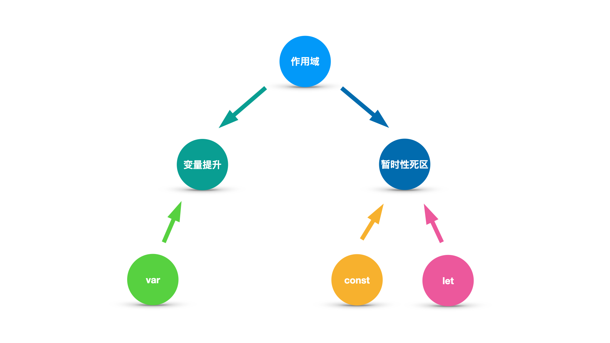

# 与变量提升同父异母的暂时性死区

## 何时出现的暂时性死区？

**ECMAScript 2015（ES6）时出现的**

## ES6 对于暂时性死区的概述

ES6 明确规定，如果区块中存在 `let` 和 `const` 命令，这个区块对这些命令声明的变量，从一开始就形成了 **封闭作用域** 。凡是在 **声明之前就使用** 这些变量，就会 **报错** 。

以上这段话可以总结为以下三点：
1. **区块中**
2. 使用 **`let` / `const`** 关键字声明变量 
3. 在 **声明之前就使用** 这些变量

满足这些条件的区块则会存在 **暂时性死区**

## 代码演示

```js
if (true) {
  // 暂时性死区开始
  tmp = 'abc'; // ReferenceError
  // 暂时性死区结束
  let tmp;
  tmp = 123;
}
```
## 总结

在代码块内，使用 **`let` / `const`** 命令 **声明变量之前** ，该变量都是 **不可用** 的。
这在语法上，称为 “暂时性死区”（temporal dead zone，简称 TDZ）。

## 为什么会出现暂时性死区？

ES6 规定在 **暂时性死区中 `let、const`** 语句 **不出现变量提升** 。  
**主要是为了减少运行时错误，防止在变量声明前就使用这个变量，从而导致意料之外的行为。**  
这样的错误在 ES5 是很常见的，现在有了这种规定，避免此类错误就很容易了。

## 为什么说暂时性死区与变量提升是同父异母呢？

因为变量提升是相对于 var 声明的函数级作用域的变量产生的现象。  
而暂时性死区是相对于 let 和 const 声明的块级作用域的变量产生的现象。  
它们都是在 **当前的作用域内** 产生的现象。

